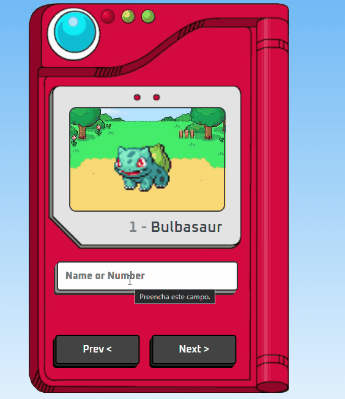

# Pokédex

## Descrição do Projeto
---

    A Pokédex realiza consultas na API pública PokéAPI, retornando as seguintes informações: nome, id e gif. Utilizando o JS, fiz a manipulação da DOM para inserir e reproduzir os dados recebidos da API.

  

## Preview do Projeto
---

 

<a href="https://brunoalaraujo.github.io/pokedex/" target="_blank"> Link para visualização do Projeto Pokédex</a>

## Tecnologias e API's Utilizados
---
<ul>
    <li>HTML</li>
    <li>CSS</li>
    <li>Javascript</li>
    <li><a href="https://pokeapi.co/">PokéApi</a></li>
</ul>

## Redes Sociais
---
<ul>
    <li><a href="https://www.linkedin.com/in/brunoandradel-a-dev/" target="_blank">LinkedIn</a></li>
    <li><a href="https://github.com/Brunoalaraujo" target="_blank">GitHub</a></li>
    <li><a href="https://brunoalaraujo.github.io/portfolio/" target="_blank">Portfólio</a></li>
</ul>